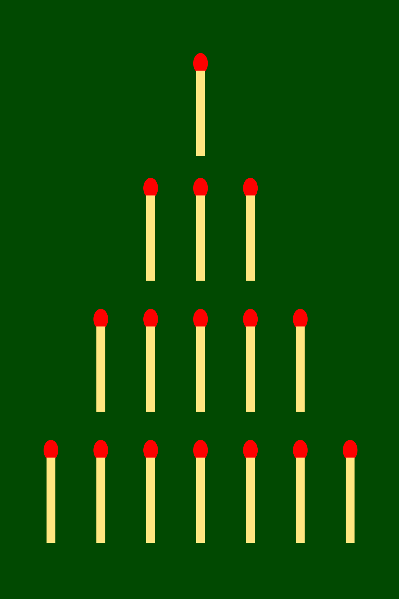

# RL-Playground

This is a playground for Reinforcement Learning algorithms. It is a simple app that allows you to play with different environments, algorithms, and hyperparameters.

What you can do with this playground:
- Prediction Problem (how strong is my policy): evaluate blind policy (i.e. non dependant on states) on 3 different environments using Q value based RL algorithms.
- Control Problem (what is the best policy): find the best policy on 3 different environments using Q value based RL algorithms.
- Modify the hyperparameters to see their impact on the results.

The app is deployed with streamlit [here](https://share.streamlit.io/tboulet/formation-reinforcement-learning/main/app.py). You may need to wake up the app from the streamlit servers.

  

This is a project in itself but also part of the [Reinforcement Learning formation](https://github.com/tboulet/formation-reinforcement-learning). All the code is available on this repo.

This playground focus on tabular RL and value-based methods.

# Environments

The environments are all tabular RL environment, with a discrete number of states and actions.

## Ocean Environment

In this environment you need to reach the beach as fast as possible. You start in the ocean and you can only move in the 2 directions. The state consist of the distance with the beach and is represented by an integer between 0 and 10 (you can't go more far than 10). The reward is -1 at each step and 0 when you reach the beach. The episode ends when you reach the beach. 

  

As you may have guessed, the optimal policy is to always go right. The optimal value function is V(s) = -s.

## Nim's Game Environment

In this game you start with 10 matches and you can remove 1, 2 or 3 matches at each step (those are your actions). The player that removes the last match loses. You play against a random agent. The state consist of the number of matches left and is represented by an integer between 0 and n_matches=25. The reward is 1 if you win, -1 if you lose and 0 if the game is not finished. The episode ends when the game is finished.

  

For this game, there is a winning strategy that consists of always leaving a multiple of 4 matches to the opponent. The optimal value function is V(s) = 1 if s % 4 == 0, x otherwise, where x<1 is a value depending of the random opponent strategy.

So in this environment, the Q values of each actions are dependant of the state, unlike in the ocean environment.

## n-Bandit Contextual Environment

In this famous environment, which is a foundation problem of theoretical RL, you have a slot machine with 4 arms. Each arm ill give you a reward following a random law that you don't now.
 
This is contextual because which arm is better depends on the state. In particular here, the expected reward is r(s,a) = (s-a-1)%4 so the optimal action for each state is pi*(s)=s.

  

There is a tradeoff between exploration of the most unknown states and exploitation of the best known states. This consist  of the very important exploration-exploitation dilemma in RL.